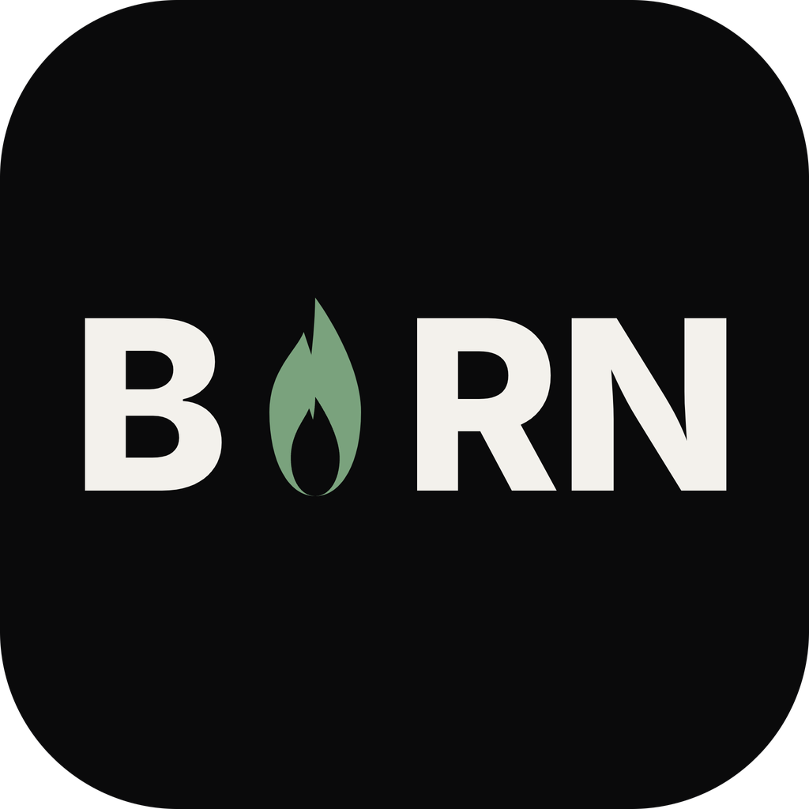

# BORN — Branham or Nothing

A free, open-source desktop app for believers to search William Branham sermon
quotes, look up Bible passages, pull up worship songs, build a service queue, and
project any of it on a second screen during a service — fully offline.

**[Download for Mac, Windows, or Linux →](https://joshmuepu.com/born#download)**

The download page has a version picker and per-platform builds. Or grab assets
straight from the [latest GitHub release](https://github.com/joshmuepu/born-app/releases/latest).

---

## Features

- **Sermon search** — instant full-text search across 1,217+ William Branham
  sermons, with year / title filters, phrase or any-word matching, and the
  searched words highlighted right in the results.
- **Bible** — KJV, WEB, and ASV bundled offline. Look up by reference
  (`John 3:16-18`) or keyword; projects one verse per slide.
- **Songs** — 1,160+ worship songs bundled, plus import from ProPresenter 7,
  OpenLyrics, OpenSong, ChordPro, or plain text. Verses / chorus / bridge are
  labelled and the song key is shown when known.
- **Service queue** — mix quotes, passages, and songs in one running order;
  reorder by drag; step through slide-by-slide with the on-screen Back / Next
  bar or the keyboard.
- **Second-screen projection** — fills the external display, auto-detects it,
  large legible text by default, live text-size control, hide-screen toggle, and
  a lower-third message banner. A separate stage monitor shows the current and
  next slide.
- **Offline-first** — every database ships inside the app; no internet, no
  account, no server.

## Platforms

| Platform | Notes |
|----------|-------|
| macOS (Apple Silicon, M1+) | macOS 11 Big Sur or later |
| macOS (Intel, x64) | macOS 11 Big Sur or later |
| Windows | Windows 10 / 11, 64-bit |
| Linux | AppImage, x64 |

The builds are not code-signed (BORN is free and unfunded). The first time you
open it, macOS or Windows will warn about an unidentified developer — the
[download page](https://joshmuepu.com/born#download) has the one-time steps.

## Development

```bash
npm install          # install deps (rebuilds better-sqlite3 for Electron)
npm run dev           # run in dev mode
npm test              # unit tests
npm run build         # type-check + bundle
npm run dist:mac      # package installers — also dist:win / dist:linux
```

`npm run build:db` and `npm run build:library` regenerate the bundled sermon and
Bible/song databases; CI runs these on every release.

Built with [Electron](https://electronjs.org), [React](https://react.dev),
[electron-vite](https://electron-vite.github.io), and
[better-sqlite3](https://github.com/WiseLibs/better-sqlite3).

## Releasing

The pushed git tag is the source of truth. To ship `vX.Y.Z`:

```bash
git tag vX.Y.Z
git push origin vX.Y.Z
```

CI stamps `package.json` with `X.Y.Z`, builds all three platforms, and publishes
a GitHub Release with assets named `BORN-X.Y.Z-<platform>.<ext>`.

## License

MIT — [joshmuepu.com](https://joshmuepu.com)
