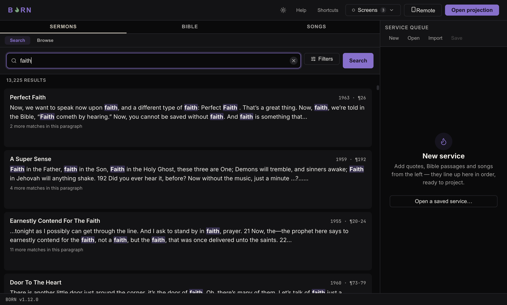
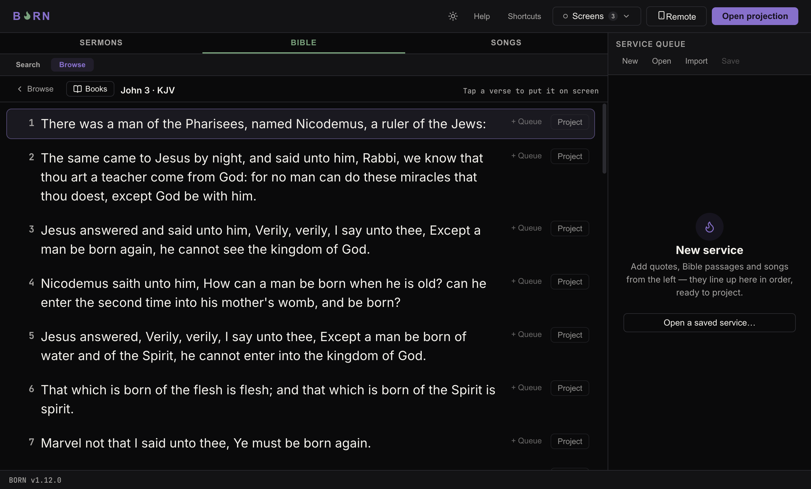

# Projecting sermons, songs & scripture

## Sermons

The **Sermons** tab has two modes, switched with the **Search** / **Browse**
buttons just under the tab row.

**Search** — type a word or phrase (e.g. `Holy Spirit`) and press Enter. Click
**Filters** next to the search box to narrow by a year range, an exact date (e.g.
`63-0825E`), or a word that must appear in the sermon's title. Each result shows
the sermon title, date, and the matching sentence with your search term
highlighted. Click a result to open the full sermon and jump straight to that
paragraph.

**Browse** — four ways into the library without typing a search term: **Date**
(jump to any Sunday — pick a year, then a month, then a day, each showing how many
sermons exist for it), **Series**, **Location** (by city or state), and
**Recently Played**.

Whichever way you found a sermon, once you're inside one, every paragraph has its
own **+ Queue** and **Project** buttons, and the currently on-screen paragraph (if
any) is marked **On screen**. Click **← Back** (top-left of that view) to return to
your search results or browse list.

## Bible

The **Bible** tab also has **Search** and **Browse** modes.

**Search** — type a reference (`John 3:16`, `John 3:16-18`) or a plain word
(`faith`). BORN tells you which one it recognized ("Recognized as John 3:16–18")
above the result. A translation picker (**KJV** by default) sits next to the
search box.

For a word search, three buttons appear under the search box:

- **Phrase** — the words must appear next to each other, in that order.
- **All words** — every word must appear somewhere in the verse, in any order.
- **Any word** — at least one of the words must appear.

A range dropdown (**Whole Bible** by default) next to the search box narrows a
word search to the Old Testament, the New Testament, or a single book.

**Browse** — a grid of every book (Old Testament and New Testament, each showing
its chapter count), then a grid of that book's chapters, then the full chapter text
with each verse individually clickable. Use **← Books** to go back a level.

Whether you searched or browsed to it, click any verse's **+ Queue** or
**Project** button to use it, the same as a sermon paragraph.

## Songs

The **Songs** tab, same **Search** / **Browse** pattern.

**Search** — type a title or a lyric you remember. Results show the song title,
how many slides it has, and its key (or "No key" if none was set on import).

**Browse** — click **All Songs** to see every song in one alphabetical list, with
an A–Z jump column on the right to skip straight to a letter. **Recently Played**
shows what's been used this session.

Every song's **+ Queue** / **Project** buttons work the same as everywhere else —
clicking one adds (or projects) the *whole song*, slide by slide, in order; once
it's the on-screen item, **Next**/**Back** move between its slides the same way
they move between a sermon's paragraphs or a Bible passage's verses.

To bring in songs that aren't already in the library, see
[Importing songs](../setup/importing-songs.md).
