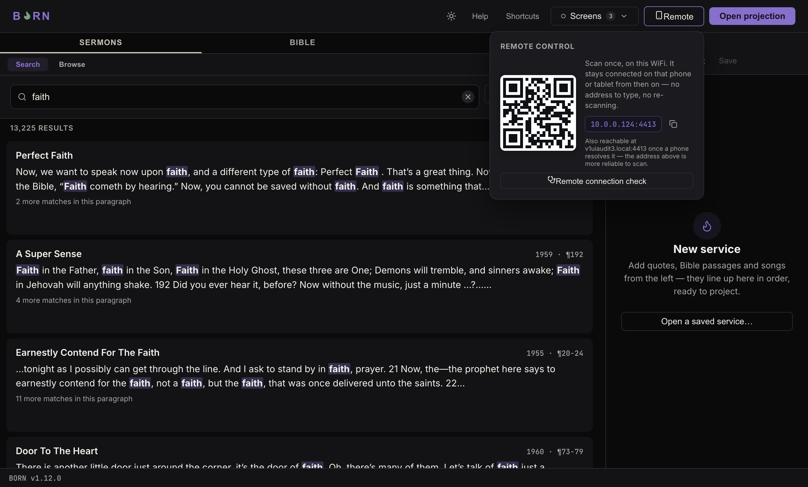
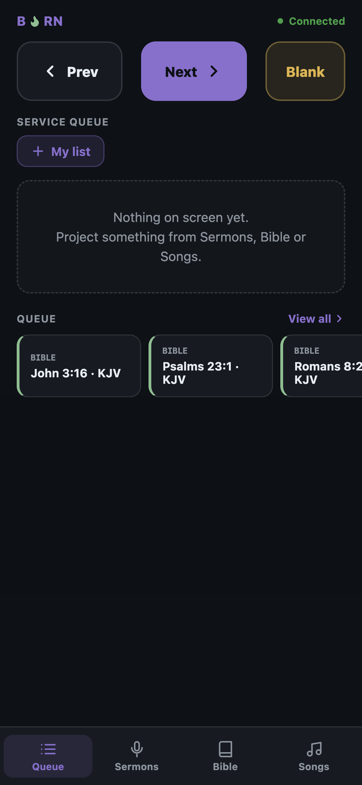

# The phone remote

A phone or tablet on the same WiFi as the BORN computer can search and advance
slides too — handy for a second operator, or for the main operator to drive from
the platform instead of a laptop.

## Connecting

1. On the BORN computer, click **Remote** in the header (top-right, next to
   **Shortcuts**).

2. A QR code and an address (like `10.0.0.124:4411`) appear. **Scan the QR code
   once, on the same WiFi** — it stays connected on that phone from then on, no
   re-scanning needed. If you can't scan it, type the address shown into the
   phone's browser instead; tap the copy icon next to it to copy it exactly.
3. The first time a phone connects, it's asked **"Who's this?"** — pick **Song
   Leader**, **Preacher**, **Operator**, or type something else under **Other…**.
   This is just a label so the operator can tell whose items are whose in a shared
   queue — no account or password is involved. Tap **Skip for now** to decide
   later.

Once connected, the remote page shows **Connected** with a green dot at the top.

## Using it

The remote has the same three content tabs as the desktop app — **Sermons**,
**Bible**, **Songs** — plus a **Queue** tab, along the bottom (or down the left
side, on a wider tablet). **Prev**, **Next**, and **Blank** sit at the top of every
tab, so you never have to switch tabs just to advance a slide.

Anything added to the queue from a phone shows up on the desktop's Service queue
immediately, and vice versa — it's the same live queue, shared.

## If a phone can't connect

Click **Remote connection check** in the Remote popover (the stethoscope-icon
button, just under the QR code). It reports:

- Whether the remote server is listening, and on which port.
- How many phones are connected right now.
- The mDNS name BORN is advertising itself as (if resolved).
- Every network adapter BORN found on this computer, and which one it picked.
- A firewall hint specific to this computer's operating system — the most common
  reason a phone on the right WiFi still can't connect is this computer's own
  firewall silently blocking the connection.

Click **Copy diagnostics** underneath to copy all of this as plain text, ready to
paste into a message to whoever handles tech support.

If the phone was connected before and now isn't (for example, after the BORN
computer restarted), reopen the remote page in the phone's browser — it reconnects
on its own once the server is back.
