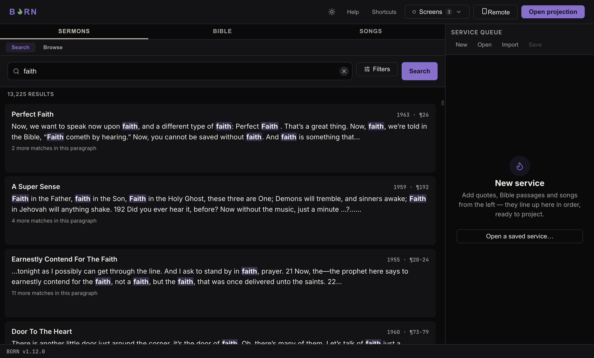

# Quick start

This walks through the whole loop once: find something, put it on screen, move to
the next thing. Everything else in this manual is detail on top of this one loop.

## 1. Open BORN

When BORN opens, you land on the **Sermons** tab with an empty **Service queue** on
the right, ready to go.

## 2. Find something

Across the top of the left panel are three tabs: **Sermons**, **Bible**, **Songs**.
Each one has its own **Search** and **Browse** mode (the two small buttons just
under the tab row).

Type into the search box and press Enter, or click **Search**. For example, type
`faith` on the Sermons tab and press Enter — a list of sermon quotes containing
that word appears.

See [Projecting sermons, songs & scripture](content-types.md) for the full detail
on each of the three tabs.

## 3. Put it in the queue, or put it straight on screen

Every result row has two buttons on the right:

- **+ Queue** — adds it to the **Service queue** on the right, to come back to later
  without losing your place.
- **Project** — puts it on screen immediately.

Build up a queue by clicking **+ Queue** on everything you plan to use for the
service, in the order you'll use them — the first hymn, the sermon quote, the
closing verse — so during the service you're just clicking **Next**, not searching.

## 4. Open the projection window

Click **Open projection** in the top-right corner (or press
<kbd>⌘/Ctrl</kbd>+<kbd>Shift</kbd>+<kbd>W</kbd>). BORN opens a second window and
sends it to the Congregation screen automatically — see
[Connecting a second screen](../setup/displays.md) if it picks the wrong screen or
you don't have one connected yet.

## 5. Go live

With the projection window open, click **Project** on whatever you want to show
first. The **Service queue** panel on the right now shows **Back** and **Next**
buttons at the bottom — use **Next** to move forward through everything in the
queue, verse by verse, slide by slide, item by item. The bottom-right corner always
shows a small copy of exactly what the congregation is currently looking at, so you
can glance down and confirm instead of turning around to check the real screen.

When you're done, see [Hiding, clearing, and messages](blank-clear.md).
