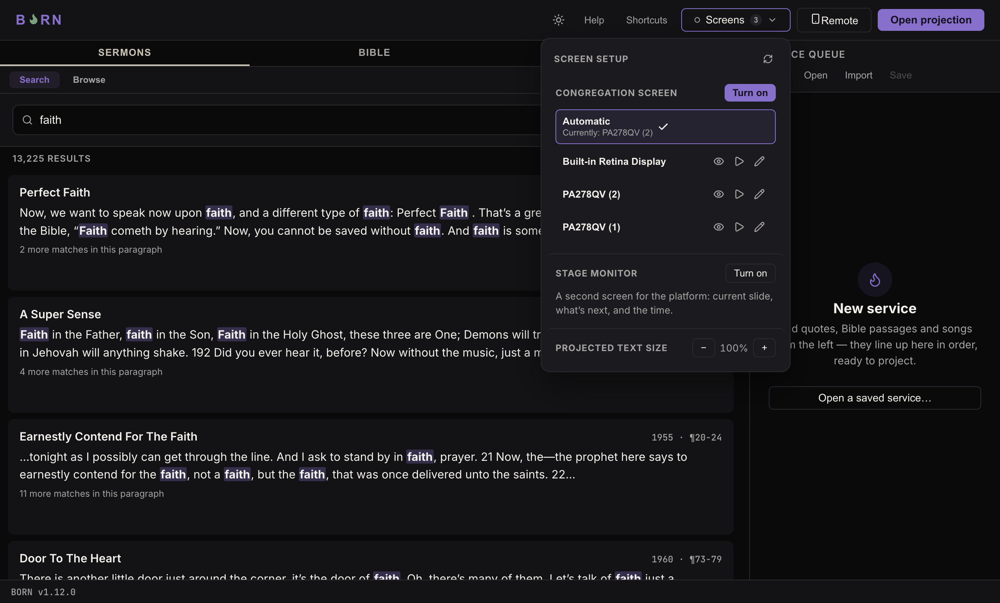

# Connecting a second screen

Plug in the Congregation screen (and Stage monitor, if used) **before** opening
BORN or clicking **Open projection** — BORN picks up connected screens when it
starts and when you open the Screens panel, not continuously in the background.

## Choosing which screen is which

Click **Screens** in the header (it shows how many displays BORN currently sees,
e.g. "Screens 3"). This opens **Screen setup**:

- **Congregation screen** — click **Turn on**, then pick a screen from the list
  below it. **Automatic** (the default) picks whichever non-laptop screen is
  connected for you — this is right for almost every setup with exactly one extra
  screen. Pick a specific screen by name instead only if you have more than one
  extra screen and need to choose which one is the Congregation screen.
- **Stage monitor** — same idea, **Turn on** and pick a screen, only if a second
  extra screen is connected for the platform.

Each screen in the list has three small icon buttons: an eye (**Identify** — flash
that screen so you can see which physical one it is), a play triangle (**Test
pattern** — show sample projected text on it, to check size/position before a real
service), and a pencil (**Rename** — give it a name like "Sanctuary Projector" so
it's easy to recognize in this list later).

## If a screen isn't showing up

Click the screen's own troubleshooting link ("Not seeing a screen you expect?") in
the Screens panel. It walks through, in order:

1. Check the cable is in a native HDMI/DisplayPort port on the computer itself —
   not a USB-C hub or dock. Hubs are a common, silent point of failure for exactly
   this.
2. **On Windows**: <kbd>Win</kbd>+<kbd>P</kbd> → make sure it's set to **Extend**,
   not "PC screen only" or disconnected. Settings → System → Display → click
   **Detect** if it's not listed.
3. **On Mac**: System Settings → Displays → click **Detect Displays** (hold
   <kbd>Option</kbd> while the menu is open on older macOS).
4. If it still won't show up, the computer may have hit its maximum number of
   simultaneous displays (common with a laptop's built-in graphics). If a video
   switcher (e.g. an ATEM) is available, try routing the screen through its output
   instead of plugging it directly into the computer.

A **Copy diagnostic info** button sits under this checklist — it copies everything
BORN knows about connected displays as plain text, ready to paste to whoever
handles tech support.

## Projected text size

At the bottom of the Screens panel, **Projected text size** has **−** and **+**
buttons and a percentage (100% by default) — this scales the text on the
Congregation/Stage screens up or down, independent of the content itself, for a
screen that's unusually close or far from the congregation.
