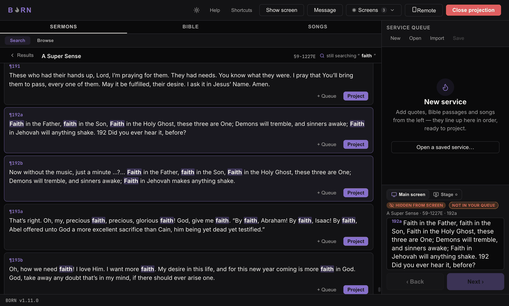
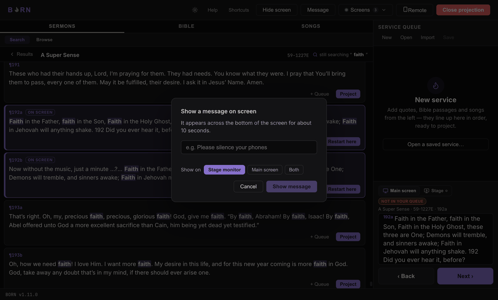

# Hiding, clearing, and messages

## Hide screen / Show screen

Once the projection window is open, a button appears that reads **Hide screen**.
Click it (or press **Esc**) to black out the Congregation screen — the congregation
sees plain black, nothing else. The button now reads **Show screen**; click it (or
press **Esc** again) to bring back whatever was already projected.

> **Not yet verified as working:** the button is designed to turn solid amber
> while the screen is hidden, as an unmistakable "the congregation currently sees
> nothing" signal. In the running app at the time of writing, it does not
> visually change color — only its label changes. Rely on the label text
> ("Show screen" = currently hidden) until this is fixed.

This is the button to reach for between items, or any time you want the room's
attention off the screen — it's deliberately the one thing in BORN that's always in
the same place every service. There's no separate "Clear" button — **Hide screen**
is how you clear the congregation's view between items.

> **Hiding is not the same as closing the projection window.** Hiding just blacks
> out the picture; whatever was on screen is still "loaded" and comes straight back
> when you show it again. Closing the projection window (rare — mostly done at the
> very end of a service) is a bigger step and stops the feed entirely.

## Showing a one-off message

Click **Message** (next to Hide/Show screen) to put up a short line of text without
touching your queue — useful for "Please silence your phones" or a quick
announcement.

Type the message, choose where it shows (**Stage monitor**, **Main screen**, or
**Both**), and click **Show message**. It appears across the bottom of the screen
for about 10 seconds, then clears itself automatically — you don't need to dismiss
it.

**How to know it worked:** the message appears as an amber bar across the bottom of
the chosen screen(s), over whatever else is showing, and disappears on its own.

---

Next: [The mobile remote](mobile-remote.md).
