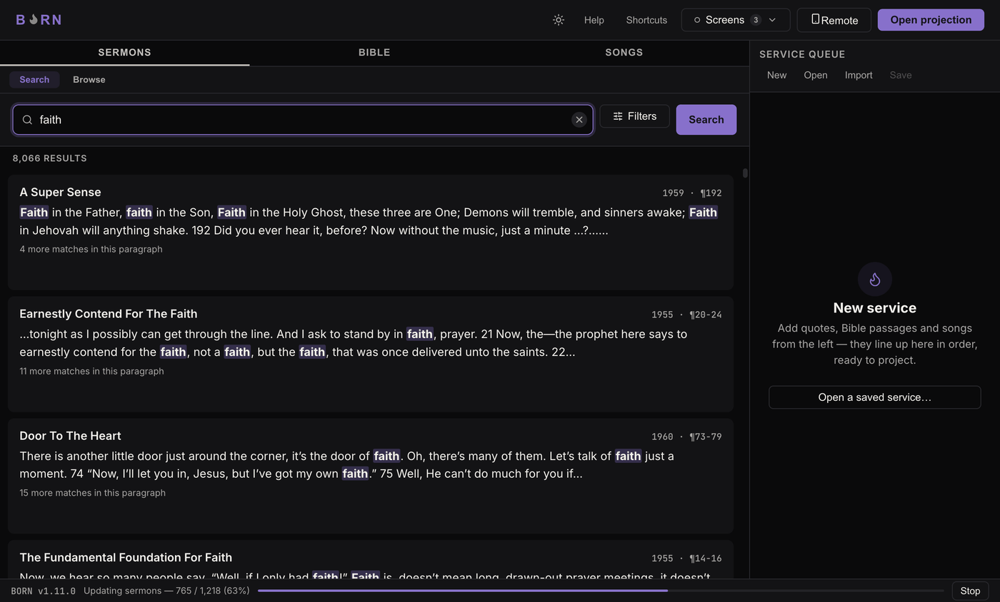
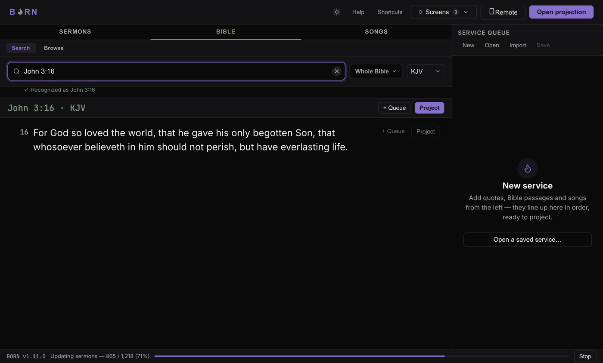
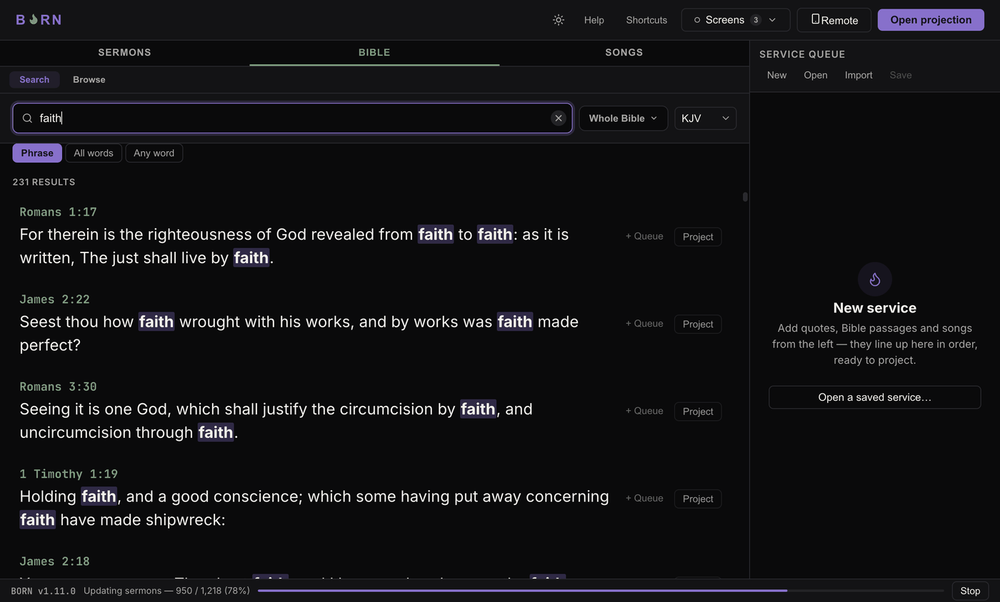
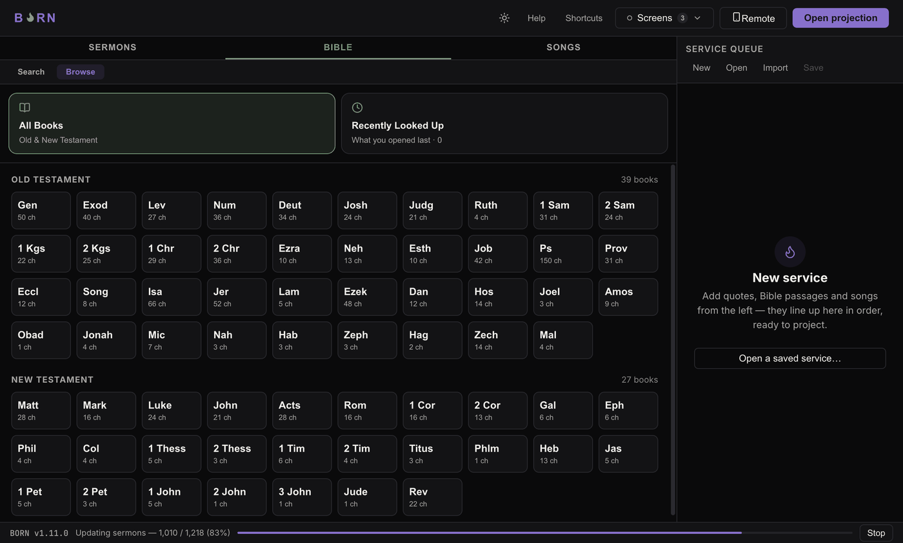
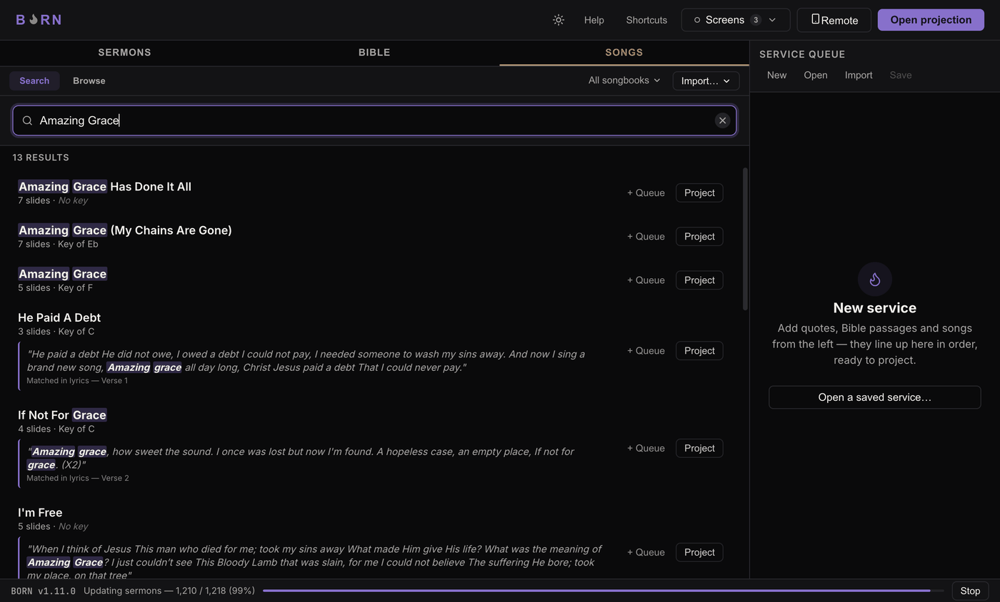

# Projecting each content type

## Sermons (quote search)

Click the **Sermons** tab. Type a word or phrase into the search box
("*Search for a word or phrase — e.g. Holy Spirit*") and press Enter. Every
matching word is highlighted in the results so you can tell at a glance why a
result matched.

Click **Filters** (it shows a count, e.g. "Filters (2)", once any are active) to
narrow by year range, an exact date, or a sermon title — and to switch matching
between **Phrase** (exact wording), **All words** (every word, any order), and
**Any** (word). **Clear filters** resets all of it.

Each result shows **Add to Queue** and **Project** — click **Project** to put it on
the screen immediately, or **Add to Queue** to line it up for later.

**How to know it worked:** the quote's text appears on the Congregation screen,
matching what the result card showed.

## Bible

Click the **Bible** tab. There are two sub-tabs: **Search** and **Browse**.

### Search

Type into the box — it understands two kinds of input at once:

- **A reference**, like `John 3:16` or `John 3:16-18` — BORN recognizes this as
  you type and shows **"Recognized as John 3:16"** underneath, then looks the
  passage up directly.
- **A word or phrase**, like `faith` — if what you typed isn't a reference, BORN
  searches the text of every verse instead, with three modes next to the box:
  **Phrase** (the exact wording), **All words** (every word, any order), **Any
  word** (any one of the words). A dropdown next to it limits the search to
  **Whole Bible**, **Old Testament**, **New Testament**, or one specific book.

Pick a translation from the dropdown near the top — every channel that **follows**
this one will show its own translation of the same verse; see
[Channels & a second language](../setup/channels.md) if that's new to you.

### Browse

Click **Browse** to flip through the Bible without typing anything: **All Books**
(Old & New Testament, by abbreviation) or **Recently Looked Up**. Click a book,
then a chapter number, to open the reading view — **← Books** returns to the
chapter grid.

Every verse shown has its own **+ Queue** / **Project** buttons.

**How to know it worked:** the verse number and text on the Congregation screen
match the reference shown in BORN.

## Songs

Click the **Songs** tab and type part of the title or a lyric into **"Search
titles & lyrics…"**. Each result shows the song's verses, chorus, and bridge
labelled separately, and its key when known. **+ Queue** / **Project** work the
same as everywhere else — projecting a song starts at its first labelled section;
use **Back**/**Next** to move through the rest.

**How to know it worked:** the song's current section label (e.g. "Chorus") and
its text appear on the Congregation screen.

---

Next: [Hiding, clearing, and messages](blank-clear.md).
