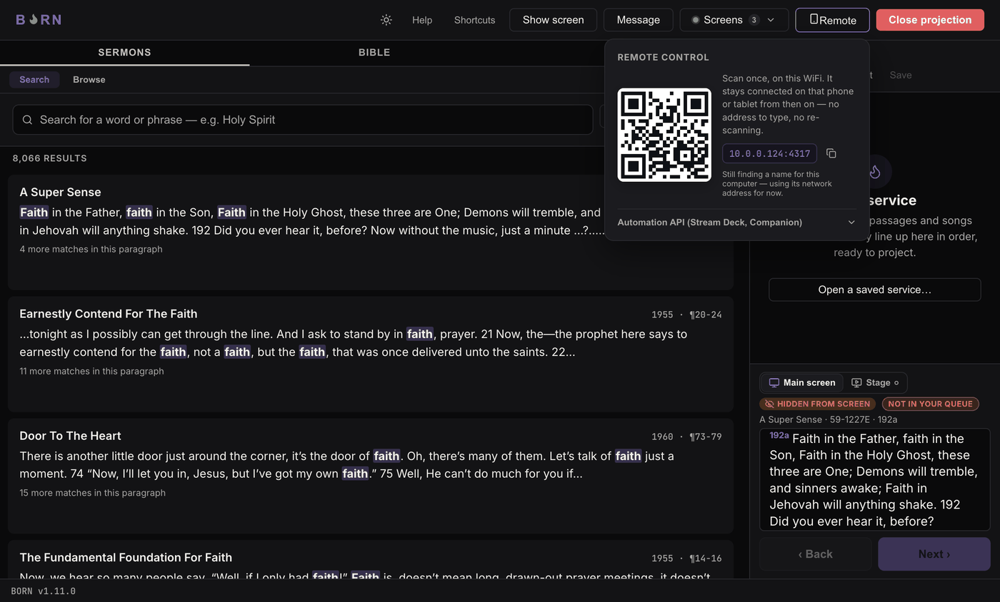
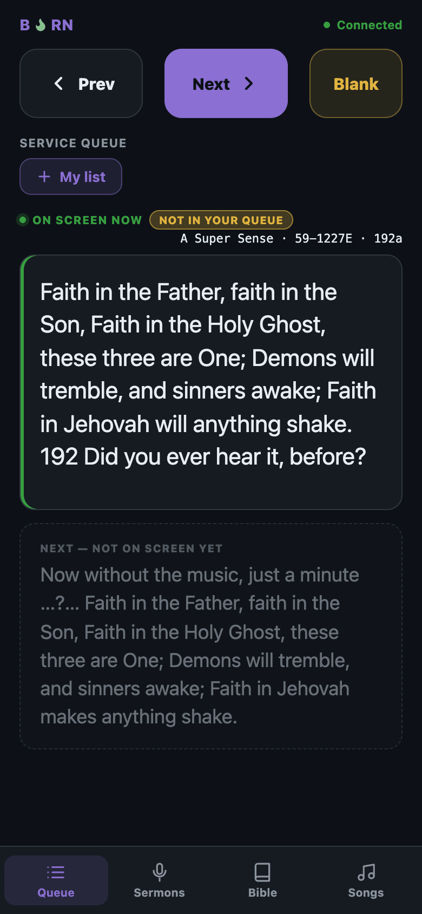

# The mobile remote

A phone or tablet, on the same WiFi as the BORN computer, can search and advance
slides from anywhere in the building — handy for a second contributor, or for
walking the room while still controlling the queue.

## Connecting a phone, step by step

1. On the BORN computer, click the **Remote** button (top of the window, phone
   icon). A popover opens showing a QR code.

   

2. On the phone, open its camera (or QR scanner) and point it at the QR code. It
   should offer to open a web page — tap it. (No app to install — this opens
   straight in the phone's browser.)
3. The first time, a card appears asking **"Who's this?"** — pick **Song Leader**,
   **Preacher**, **Operator**, or type your own name. This only labels whose items
   are whose if more than one phone is contributing; it's not a login and nothing
   is saved to an account. You can tap **Skip for now** instead.
4. You may also see a prompt to **"Add this to your Home Screen"** — doing so puts
   a BORN icon on the phone for next time, so there's no QR code or typing needed
   again. **Skip for now** works fine too; you can always reopen it from the
   browser.

**How to know it worked:** the phone shows the same queue BORN's main window does,
and the connection indicator (top of the phone screen) shows connected, not
"Connecting…".

## Using it

The phone has its own transport bar (**Prev** / **Next** / **Blank**) always
visible at the top, and four tabs at the bottom: **Queue**, **Sermons**, **Bible**,
**Songs** — the same searches as the desktop app, sized for a phone screen.

Once connected on a given WiFi network, the phone stays connected on future visits
— no need to scan the QR code again unless it's a different network.

---

Next: [The Screens menu](screens-menu.md).
