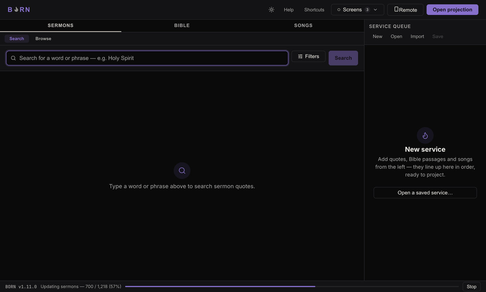
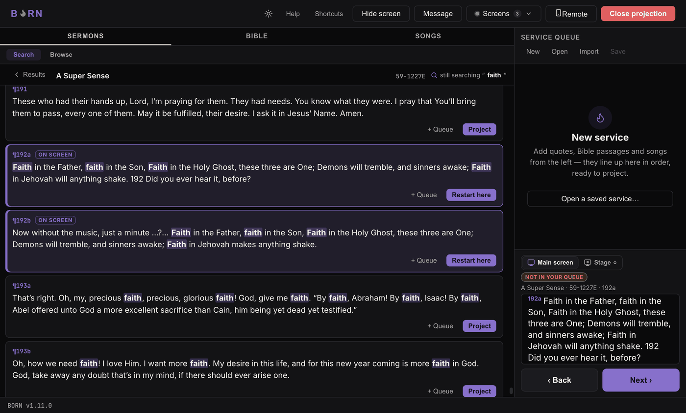

# Quick start

This walks through running a service from a completely empty BORN window, start to
finish. If someone has already set up your displays, channels, and Graphics output
(see [Setup & Admin](../setup/installing.md)), you won't need to touch any of that —
this page only covers the operator's side.

## 1. Open BORN

Double-click the BORN icon. You'll see one of two things:

- **A "New service" screen** (nothing built yet) — this is normal the first time, or
  any time you start fresh.
- **Your last service, already loaded** — BORN remembers what you were working on.

## 2. Find something to put on the screen

Across the top-left of the window are tabs for **Sermons** (quote search), **Bible**,
and **Songs**. Click the one you need, then:

- **Sermons** — type a word or phrase, press Enter. Matching words are highlighted
  in each result.
- **Bible** — type a reference (`John 3:16`) or a keyword, depending on which tab
  you're on inside Bible.
- **Songs** — type part of the title or first line.

See [Projecting each content type](content-types.md) for the full walkthrough of
each one.

## 3. Open the projection window

The first time in a session, click **Open projection** near the top of the window.
This is what actually turns on the feed to the Congregation screen — the Congregation
screen itself goes to a plain black screen until you project something, which is
correct and expected.

> **How to know it worked:** the Congregation screen shows solid black (not a
> frozen desktop image, not a BORN logo) — and the button that said "Open projection"
> now shows the Hide/Show-screen controls instead.

## 4. Put it on the screen

Every result has a **Project** button on it. Click it and that result appears on
the Congregation screen immediately. (To line several things up first instead of
projecting one at a time, see the next step.)

## 5. Build a running order (optional)

Instead of projecting one thing at a time, click **Add to Queue** (sermon quotes)
or **+ Queue** (Bible verses, songs) on anything you find, and it lines up on the
right side of the window in
order. Drag to reorder. Click any queued item's **Project** button (it reads
**Restart here** once it's live) to jump straight to it.

## 6. Move through it

Once something is projected, a bar fixed at the bottom of the queue shows **Back**
and **Next**, with a line above it telling you exactly what's currently on the
screen. Use Back/Next (or the **←**/**→** keys) to step through multi-slide content
like a passage or a song, one verse/line at a time.

> If you projected straight from a search result without adding it to the queue
> first, you'll see a small **Not in your queue** badge here — that's expected,
> not an error. It just means Back/Next has nothing queued to flow into; add it to
> the queue if you want to step through it.

**How to know it worked:** whatever the "on screen" line says matches what's actually
showing on the Congregation screen.

Continue to [Hiding, clearing, and messages](blank-clear.md) for what to do between
items, or [The Screens menu](screens-menu.md) if you need to check which display or
channel something is going to.
