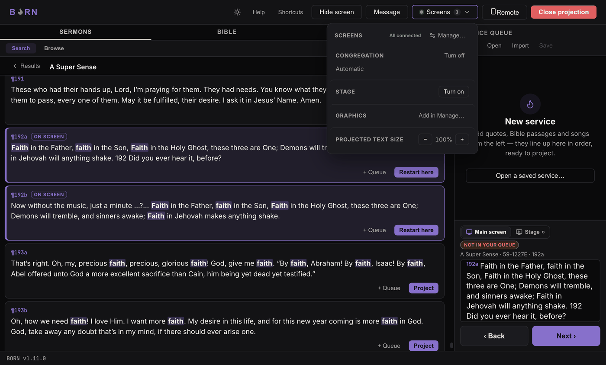
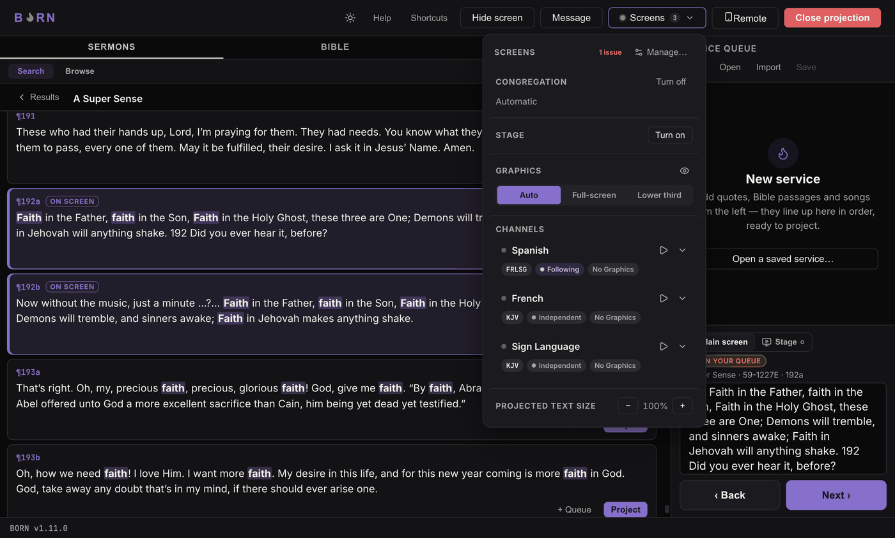

# The Screens menu

Click **Screens** (top of the window) to open a short popover showing exactly
what's live right now, with quick controls for mid-service changes. Anything
configured once — adding a channel, naming a display, adding a Graphics output —
lives one level deeper, behind **Manage…** (see below); the popover itself always
stays short.

## What's in the popover

- **Congregation** — which display it's using, and **Turn on/off**. If something's
  wrong (the named display isn't connected, or two identical displays are
  connected), a warning line appears right here, e.g.:
  *"&lsquo;Sanctuary Projector&rsquo; not detected — using a different screen
  instead."*
- **Stage** — the same, for the Stage monitor, if you use one.
- **Main's Graphics output** (if one is set up) — Clear/Show and a quick
  **Auto / Full-screen / Lower third** picker. See
  [Presentation profiles](../setup/profiles.md) for what these mean.
- **Channels** — only shown once more than one exists. Each channel is a compact
  row: a status dot, its name, chips for its translation code, whether it's
  **Following** or **Independent**, an English-fallback warning if it just used
  one, a destination-warning chip, and either its current profile or **No
  Graphics**. Click a row to expand it and see its live slide, destination status,
  and its own Graphics controls.

A small pill near the top (**All connected**, or **2 issues**) summarizes
everything at a glance.

## Manage…

Click **Manage…** to open **Outputs & Channels**, a separate panel for setup-level
changes: which display each role uses, adding/removing channels and Graphics
outputs, translation, and a full live Status breakdown. A small warning dot
appears on **Manage…** itself whenever something there needs attention, even if
you haven't opened it yet.

Four tabs: **Displays**, **Channels**, **Outputs**, **Status**. These are covered
in full in [Setup & Admin](../setup/displays.md) — day to day, you'll mostly use
the popover, and only open Manage when something needs to change.

While Manage is open, everything live keeps updating in the background — opening
it never affects what's actually projected. **Esc** closes it immediately.

---

Next, for anyone setting BORN up for the first time: [Setup & Admin](../setup/installing.md).
