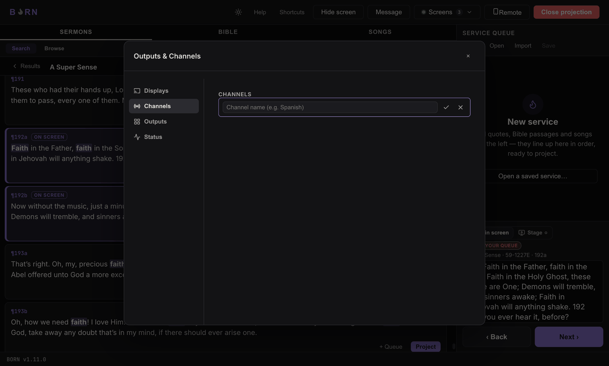
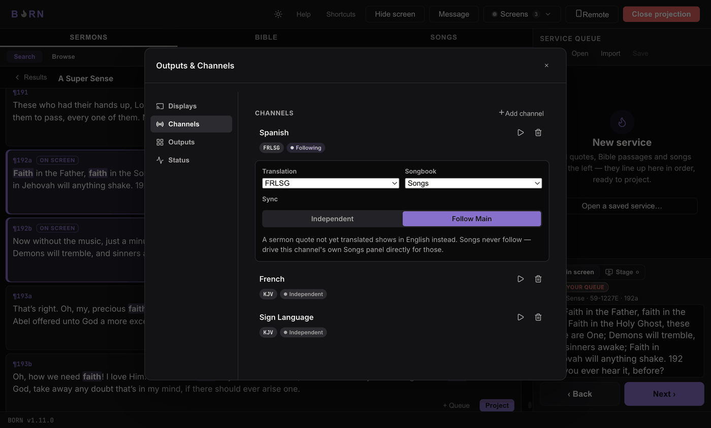

# Channels & a second language

Most services only ever use the one built-in channel, **Main**. A **channel** is a
separate, independent feed of content — add a second one when a church needs a
second language running alongside the main service, each with its own display or
Graphics output.

A channel never knows which display or Graphics output it ends up on, and a
destination never holds content of its own — a channel is just "what's live for
this audience," and a destination is just "where that gets shown." This is why you
can freely change which screen a channel lands on without touching the channel
itself, and vice versa.

## Adding a channel

In **Screens → Manage… → Channels**, click **Add channel**, type a name (e.g.
*"Spanish"*), and confirm. It appears in the list with its own translation and sync
controls.

Each channel row expands to show:

- **Translation** — which Bible translation this channel resolves verses in.
- **Songbook** — which songbook this channel's Songs search uses.
- **Sync** — **Independent** (driven on its own, by whoever opens it) or
  **Follow Main** (automatically shows whatever Main shows, re-resolved in this
  channel's own translation/language).

### Follow Main, and the English fallback

With **Follow Main** on, this channel automatically tracks Main slide-for-slide —
when Main shows John 3:16, this channel shows the same verse in its own
translation, with no one needing to drive it separately.

If that channel's translation has no version of the current content (a sermon
quote not yet translated into that language, or a Bible translation missing that
verse), BORN shows the **English** version instead and marks it with a visible
fallback note, both in the Screens popover and on this channel's own Graphics
output — it never shows a blank slide.

> **Songs never follow.** A song has no "same slide in another language" — drive a
> following channel's own Songs search directly (the ▶ button on its row, titled
> "Open &lt;channel name&gt;") for song content on that channel.

## Driving a channel directly

Click the **▶** button on a channel's row (in the popover, or Manage's Channels
tab) — its tooltip reads "Open &lt;channel name&gt;" — to open that channel's own
small Bible/Sermons search, exactly like the main window's, but whatever you
project there only affects this channel, not Main.

**How to know it worked:** the channel's own Graphics output (or display, if it has
one) shows the content you just sent it, independently of what Main is showing.

---

Next: [Graphics output & OBS](graphics-obs.md).
