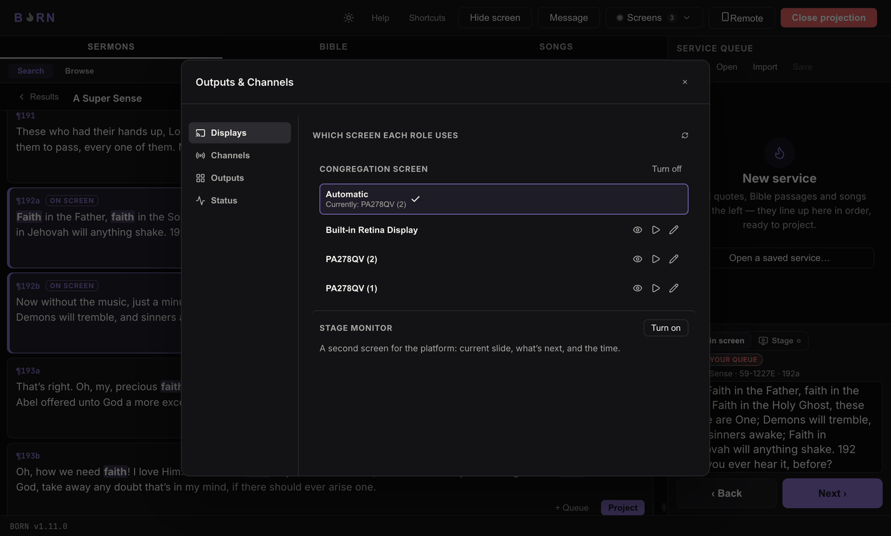
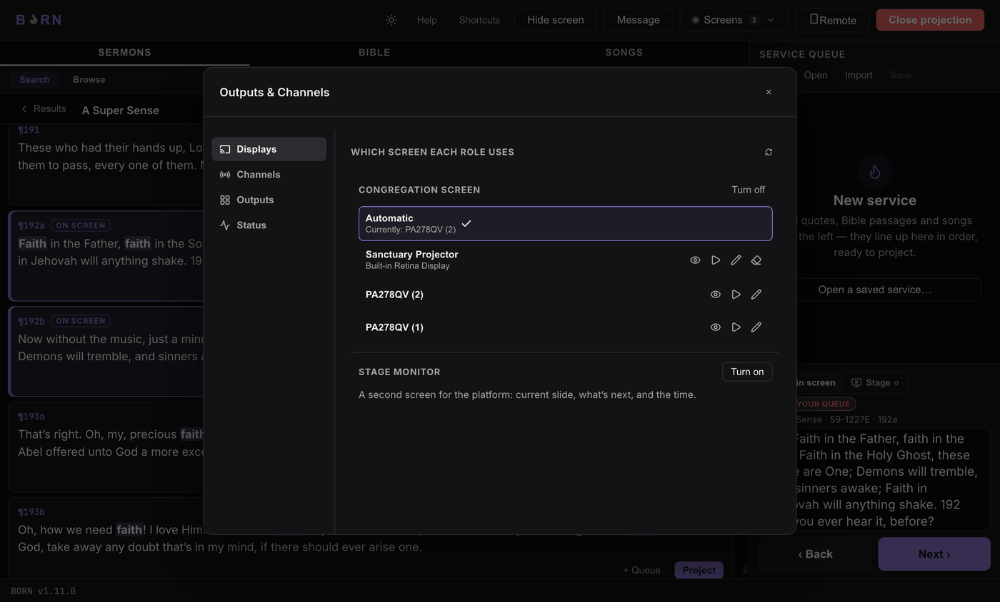

# Connecting & naming displays

In **Screens → Manage… → Displays**, you'll find two sections: **Congregation
screen** and **Stage monitor**. Each lists every display BORN can currently see,
plus an **Automatic** option.

## Automatic vs. picking one by hand

Left on **Automatic**, Congregation picks the first external (non-laptop) display
it finds; Stage picks a different spare display if one exists, otherwise it falls
back to a floating window instead of a dedicated screen. Click a specific display
in the list to pin that role to it by name — useful once you have more than one
external display and want to guarantee which is which, every time, even if they're
plugged in in a different order next week.

## Telling two displays apart

Each display row has two buttons to help you confirm which physical screen you're
looking at:

- **Identify** — flashes that display briefly, so you can see which one it is.
- **Test pattern** — shows sample projected text on it for a few seconds, so you
  can confirm legibility/placement without actually projecting live content.

## Naming a display

Click the pencil icon on a display row to give it a name (e.g. *"Sanctuary
Projector"*) — this is what shows in the picker and in warnings from then on,
instead of a raw model name like "PA278QV (2)".

### Clearing a name

If a named display no longer needs that name (you're decommissioning it, or
reusing the monitor elsewhere), click the eraser icon next to it to clear the name.
This works even if that display is currently **disconnected** — disconnected named
displays still show in the list specifically so a stale name can be cleaned up.

If a role (Congregation or Stage) was pointed at the name you just cleared, that
role falls back to **Automatic** and a one-line note appears explaining what
happened. **Clearing a name never moves or closes anything already projecting** —
only the saved name itself changes.

## When something's not showing up right

Two warnings can appear on a display row or in the popover:

| Warning | What it means | What to do |
|---|---|---|
| *"&lsquo;Name&rsquo; not detected — using &lt;X&gt; instead"* | A display you named isn't connected right now, so BORN fell back to a different screen. | Check the cable, or re-pick the display once it's reconnected. |
| *"Two identical displays connected — confirm this is the right one"* | You have two of the exact same monitor model/resolution connected, and BORN can't tell them apart beyond left-to-right position — it picked one, but a reboot or a different plug order could silently pick the other one next time. | Confirm visually (Identify helps), and consider using different monitor models for roles you need to always land correctly. |

If a display genuinely isn't showing up in the list at all, click the troubleshoot
(?) icon that appears next to a missing named display after a couple of misses, or
see [Setup warnings explained](../troubleshooting/setup-warnings.md). In short:

1. Check the cable is in a native HDMI/DisplayPort port on the computer itself —
   not a USB-C hub or dock. Hubs are a common, silent point of failure for exactly
   this.
2. **Windows:** Win+P → make sure it's set to "Extend", not "PC screen only" or
   disconnected. Settings → System → Display → click **Detect** if it's not listed.
3. **Mac:** System Settings → Displays → click **Detect Displays** (hold Option
   while the menu is open on older macOS).
4. If it still won't show up, your computer may have hit its maximum number of
   simultaneous displays. If you have a video switcher (e.g. an ATEM), try routing
   this screen through its output instead of plugging it directly into the
   computer.

---

Next: [Channels & a second language](channels.md).
