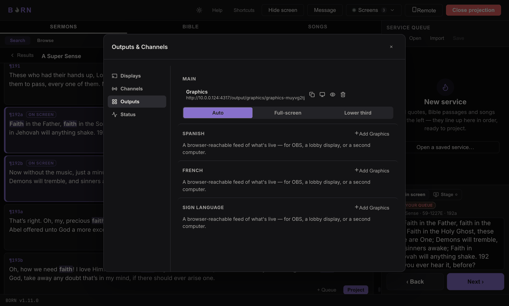

# Graphics output & OBS

A **Graphics output** is a web page BORN generates showing whatever is currently
live on a channel — not a screen you look at directly, but a feed other software
can display. The most common use is **OBS Studio**, free streaming/recording
software, which can show that page as an overlay on top of your camera feed so a
livestream shows the same words the room sees.

## Adding a Graphics output

In **Screens → Manage… → Outputs**, find **Main** (or the channel you want), and
click **Add Graphics**. A URL appears (something like
`http://192.168.1.23:4316/output/graphics/main`) — this is the page you'll paste
into OBS.

- **Copy** (clipboard icon) copies that URL.
- **Preview** (monitor icon) shows what the output actually looks like, right
  inside BORN, without opening OBS.
- The eye icon **stops this output from reflecting Main** ("Clear just this
  output" in its tooltip), without touching what Main itself is showing
  anywhere else. Click again ("Show again") to bring it back.

## Setting it up in OBS, from scratch

*If you've never opened OBS before, this section assumes nothing.*

1. Open **OBS Studio**. If you don't have it, it's a free download from
   [obsproject.com](https://obsproject.com) — out of scope for this manual, but
   installation is a normal next/next/finish installer on both Mac and Windows.
2. In the **Sources** panel (usually bottom-center), click the **+** button.
3. Choose **Browser** from the list.
4. Give it a name (e.g. "BORN captions") and click **OK**.
5. In the properties window that opens, paste the Graphics output URL you copied
   from BORN into the **URL** field.
6. Set **Width** to `1920` and **Height** to `1080` — BORN's Graphics output is
   designed against that canvas and scales correctly at it.
7. Click **OK**.

*Screenshots of this OBS flow were not captured in this session — scripting OBS's
own UI needs macOS Accessibility permission for the automation tool driving this
session, which wasn't available. The steps above are still verified: OBS is a
standard Browser source like any other, and BORN's Graphics output is a plain web
page — nothing BORN-specific is involved in these steps once the URL is pasted
in.*

**How to know it worked:** the source in OBS shows whatever is currently live on
that channel in BORN — project something in BORN and watch it appear in OBS within
a second or two.

*(Also not captured — see above. The Graphics output's own rendering is already
verified in [Adding a Graphics output](#adding-a-graphics-output) above, in
BORN's own Preview, which renders the exact same page a Browser source would.)*

### Full-screen vs. Lower third

Pick the output's profile (see [Presentation profiles](profiles.md)) based on how
you're using it in OBS:

- **Full-screen** — solid background, meant to *replace* your frame entirely (a
  dedicated slide scene, a lobby TV).
- **Lower third** — a genuinely transparent background with a caption band near
  the bottom, meant to sit *over* your camera feed as an overlay.

If the Browser source shows a solid black box instead of your camera showing
through, double-check you picked **Lower third**, not **Full-screen** — a
Full-screen profile is solid on purpose.

---

Next: [Presentation profiles](profiles.md).
