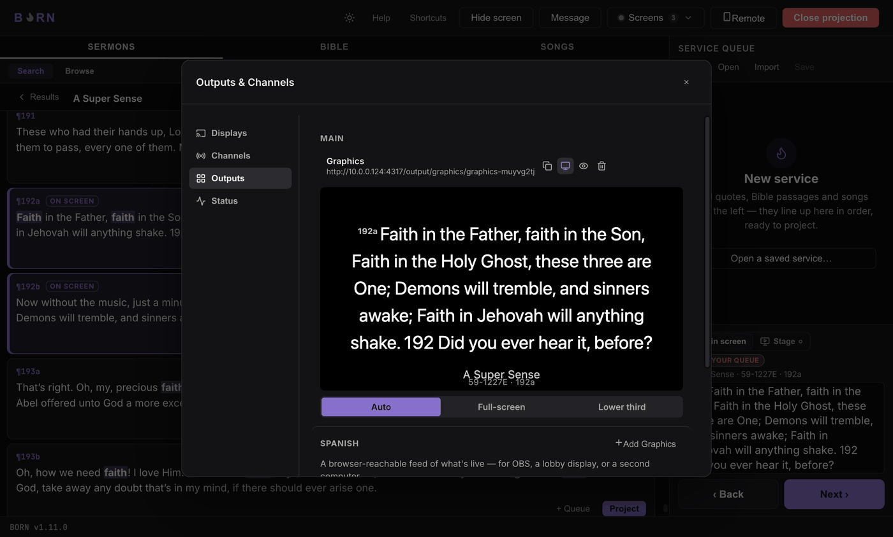

# Presentation profiles

A **profile** decides how a Graphics output lays out whatever's live — same
content, different treatment. Every output has its own profile picker:

- **Auto** — picks automatically from what's live: songs get **Lower third**,
  Bible verses and sermon quotes get **Full-screen**. This is the default and
  usually the right choice — it's the one option that keeps adapting as different
  kinds of content come through.
- **Full-screen** — always solid, replacing the whole video frame. Good for a
  lobby TV or a dedicated slide, where nothing else needs to show through.
- **Lower third** — always a transparent background with a caption band near the
  bottom. Good for an OBS overlay sitting on top of a camera feed.

Picking **Full-screen** or **Lower third** by hand turns **Auto** off for that
output — you're explicitly overriding what it would have picked. Switch back to
**Auto** any time.

**How to know it worked:** open the output's **Preview** (in Manage → Outputs) and
project a song vs. a Bible verse — on Auto, you should see the layout change
between them; on a fixed profile, it should stay the same either way.

---

Next: [Songbooks & import](songbooks.md).
