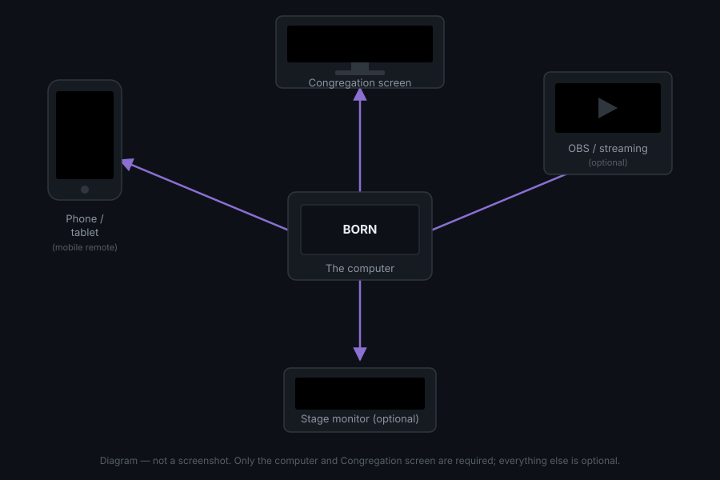

# What BORN is

*BORN manual — v2 · Updated 2026-10-07. Upgrading from v1? See [What's new in
v2](whats-new.md).*

**BORN** (short for *Branham or Nothing*) is a free computer program for running the
screens during a church service. One person — the **operator** — sits at a laptop
or desktop computer and searches for a sermon quote, a Bible verse, or a song, then
puts it up on the screen the congregation sees. Everything happens on that one
computer; BORN does not need the internet to work.

> **Words used on this page**: a "screen" below always means something the
> *congregation* or the *stage* looks at (a TV, a projector, a monitor) — never the
> small laptop screen the operator is looking at. See [Words you'll see](#words-youll-see)
> below for more.

## How the pieces connect

- **The computer** — runs BORN. This is where the operator searches and clicks.
- **The Congregation screen** — a projector or TV the congregation faces. BORN calls
  this the **Congregation** display. It shows the words in large text.
- **The Stage monitor** *(optional)* — a smaller screen facing the stage/platform, so
  whoever is speaking or leading worship can see the current line without turning
  around to look at the congregation screen.
- **A phone or tablet** *(optional)* — can run BORN's own **mobile remote**: a page
  in the phone's browser that lets a second person search and advance slides from
  anywhere in the building, on the same WiFi.
- **OBS / streaming software** *(optional)* — if the service is streamed online, BORN
  can also feed the current slide into free software called **OBS Studio** as a
  see-through overlay, the same way a sports broadcast overlays a scoreboard.

None of these extra pieces are required. The simplest possible setup is one laptop
plugged into one TV.

## Words you'll see

A short glossary of terms used throughout this manual — the full version is in
[Glossary](glossary.md).

| Word | Means |
|---|---|
| **Display** | Any physical screen your computer can show something on — a TV, a projector, a monitor. |
| **Congregation** | The display the congregation looks at. |
| **Stage monitor** | A second, optional display facing the stage. |
| **Channel** | A separate "feed" of content — most services only use the one built-in channel (**Main**), but a church with a second language can add a second channel that runs its own translated version alongside it. |
| **Graphics output** | A web page BORN can generate showing whatever is currently live — pasted into OBS as a "Browser Source" so a livestream shows the same words the room sees. |
| **Profile** | How a Graphics output is laid out: **Full-screen** (replaces the whole video frame) or **Lower third** (a caption band near the bottom, over other video). |

## What you need on Sunday morning

- [ ] The computer BORN is installed on, powered on
- [ ] The Congregation screen (projector/TV) connected and turned on, **before** you
      open BORN — see [Connecting & naming displays](setup/displays.md) if it's
      never been set up before
- [ ] (If used) the Stage monitor connected and turned on
- [ ] (If streaming) OBS Studio open with its Browser Source already added — see
      [Graphics output & OBS](setup/graphics-obs.md) if this is the first time
- [ ] A few minutes before the room fills up, to glance at the
      [Service Day cheat sheet](operators/cheat-sheet.md) if you're new to this

If you've never used BORN before, continue to [Quick start](operators/quick-start.md).
