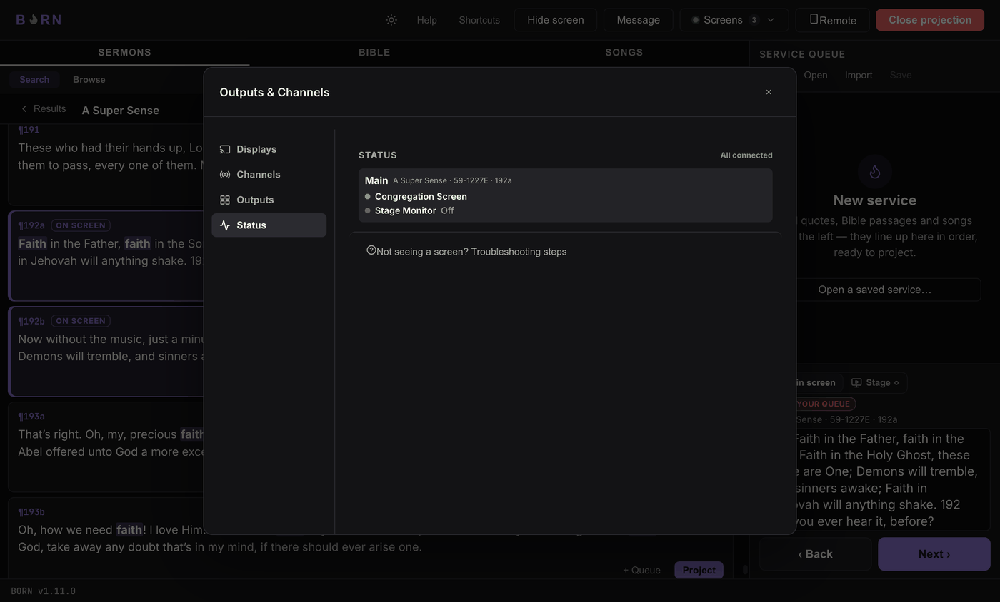

# On service day

Quick symptom → fix, written for the operator at the console mid-service. If
you're the person who sets BORN up rather than runs it day to day, also see
[Setup warnings explained](setup-warnings.md) for the exact wording of every
warning BORN can show.

## "I see nothing on the Congregation screen at all"

1. Is the TV/projector actually on, and on the **right input/source**? This is the
   single most common cause and has nothing to do with BORN.
2. In BORN, does the button near the top say **Open projection**, or does it show
   Hide/Show-screen controls already? If it still says "Open projection," click it
   — the screen stays black until something is actually projected, which is
   normal, but the *window* itself has to be opened first.
3. Is the screen showing solid black because it's **hidden**? The Hide/Show-screen
   button turns solid amber and reads **Show screen** while hidden. Press **Esc**
   or click it to show.
4. Still nothing? Open **Screens** — does the Congregation row show a warning
   line? If so, see [Setup warnings explained](setup-warnings.md).

## "It's projecting, but on the wrong screen"

Open **Screens → Manage… → Displays** and check which display **Congregation** is
actually set to. If it's on **Automatic** and picked the wrong one, pick the
correct display by name instead — see [Connecting & naming
displays](../setup/displays.md).

## "OBS shows blank / black where the captions should be"

- If the Browser source shows **solid black**: it's probably on the
  **Full-screen** profile, which is solid by design. Switch it to **Lower third**
  if you want it to sit transparently over your camera — see [Presentation
  profiles](../setup/profiles.md).
- If the Browser source shows **nothing rendering at all** (not even a black box):
  check Screens → Manage… → Status for a **"No viewer connected"** warning on that
  output — see [Setup warnings explained](setup-warnings.md).
- If OBS was closed and reopened mid-service: reselect the Browser source and
  check its URL still matches what Manage → Outputs shows; if BORN's network
  address changed (e.g. the computer reconnected to WiFi), the URL may need
  re-copying.

## A warning dot appears on "Manage…" that wasn't there before

Something in setup needs attention — click **Manage…** and look for a highlighted
row; the exact message tells you what's wrong and is explained in [Setup warnings
explained](setup-warnings.md). The **Status** tab always has a **"Not seeing a
screen? Troubleshooting steps"** link if you just want the checklist directly.

