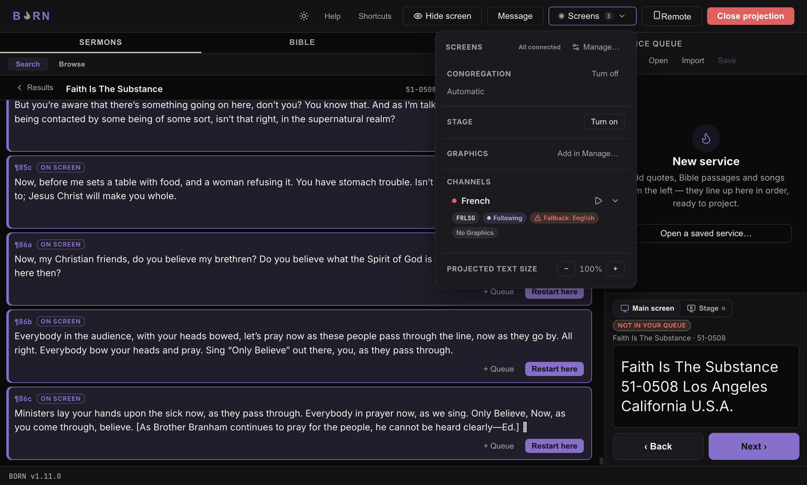
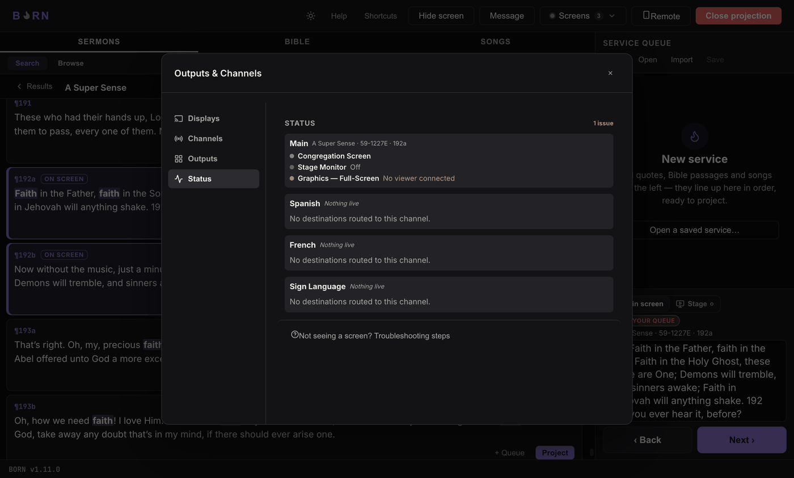

# Setup warnings explained

Every warning BORN shows is meant to be specific enough to act on without
guessing. This page lists the exact wording, where it appears, what causes it,
and the fix.

## "&lsquo;&lt;name&gt;&rsquo; not detected — using &lt;X&gt; instead."

**Where:** Congregation/Stage row in the Screens popover, and the matching
display row in Manage → Displays.

**Cause:** you named a display and pointed a role (Congregation or Stage) at it,
but nothing currently connected matches that name — most often because it's
unplugged, powered off, or the cable/port changed.

**Fix:** reconnect the named display, or in Manage → Displays, pick a different
display for that role. If you no longer need the old name at all, you can also
**Clear name** on it (see [Connecting & naming displays](../setup/displays.md)) —
clearing never changes what's currently projected.

*Screenshot not captured in this session — reproducing it means naming a display
and then physically disconnecting it, which wasn't done against the real hardware
available while writing this manual. The wording above is taken directly from the
source (`ScreensMenu.tsx`), not guessed.*

## "Two identical displays connected — confirm this is the right one."

**Where:** Screens popover (Congregation/Stage row) and Manage → Displays.

In Manage specifically, the longer version reads: *"Two identical displays are
connected — can't tell them apart with certainty, so this might be the wrong one.
Confirm it's showing on the right screen."*

**Cause:** you have two displays of the exact same model and resolution
connected, and a role is pinned to one of them by name. Software has no way to
tell two identical monitors apart beyond their left-to-right position — if that
ever changes (different port, different reboot order), the name can silently
attach to the other physical screen.

**Fix:** use **Identify** (flashes the display) to visually confirm which one is
actually selected. There's no permanent fix within what BORN can detect — if this
matters a lot to you, consider using different monitor models for roles that need
to always land correctly.

*Screenshot not captured in this session. On the real hardware available while
writing this manual (two identical external monitors), this warning did not
actually fire — macOS happened to already give the two displays distinct raw
labels, so BORN could tell them apart. This warning is for the case where the
operating system reports two displays identically; it's real code (see
`isAmbiguousMatch` in `displays.ts`), just not one this specific setup could
trigger to photograph.*

## "Fallback: English"

**Where:** a chip on a channel row (Screens popover and Manage), tooltip: *"This
channel's own translation has no version of this content — showing English
instead."*

**Cause:** this channel is set to **Follow Main** (see [Channels & a second
language](../setup/channels.md)), and the current slide has no translation into
this channel's language — either a sermon quote that hasn't been translated, or a
Bible translation missing that verse.

**Fix:** nothing urgent — BORN already showed something sensible instead of a
blank screen. If this happens constantly for a specific channel, it may mean that
translation/sermon simply isn't available yet for your content.

## "No viewer connected"

**Where:** a destination's status in Manage → Status, and as a warning dot on a
channel row.

**Cause:** a Graphics output exists, but nothing (no OBS Browser source, no
browser tab) is currently loading its page to receive updates.

**Fix:** open the output's URL in OBS or a browser (Manage → Outputs → that
output → **Copy**/**Preview**). This is expected and harmless if you simply
haven't opened OBS yet today — it only matters once you expect that output to be
live.

